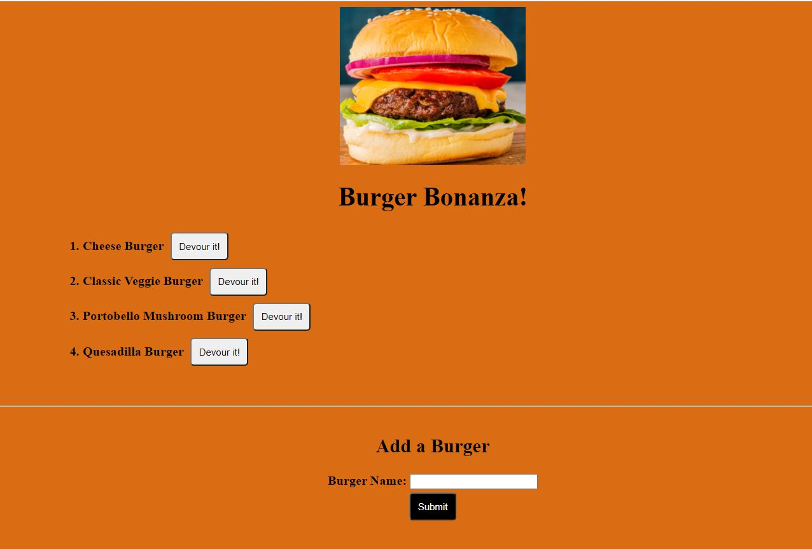
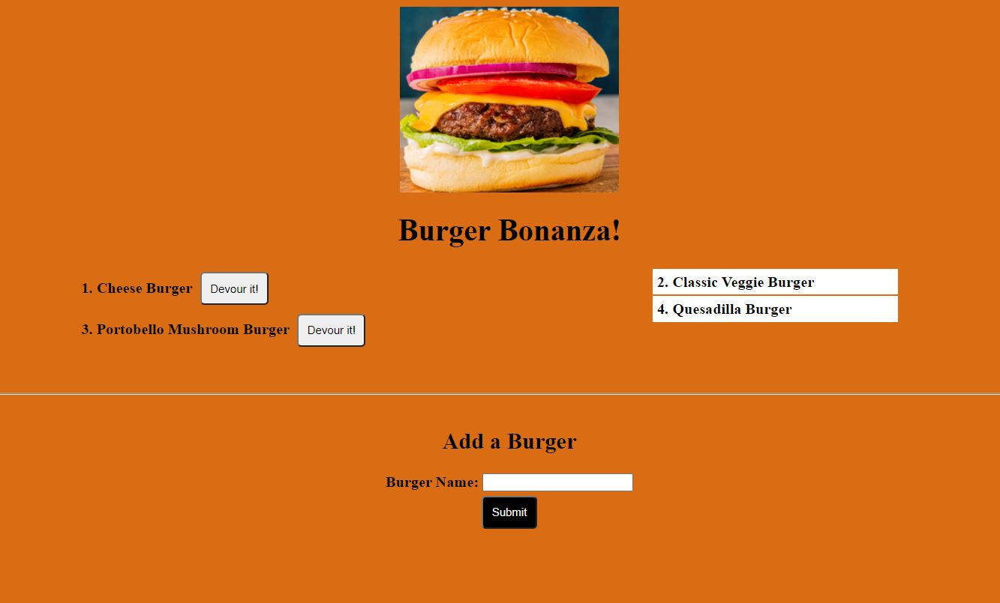

# burger
This is a burger logger with MySQL, Node, Express, Handlebars and handmade ORM. used MVC design pattern to break the application into 3 parts.

## Description
This Application builds a html file using the information provided by user
## Table of Contents
* [Installation](#installation)
* [Usage](#usage)
* [License](#license)
* [Contributing](#contributing)
* [Tests](#tests)
* [Questions](#questions)
## Installation
This application is deployed at [Heroku](https://burgerstodevour.herokuapp.com/). For this application, schema.sql & seed.sql is provided to explain the schema and table used.  Anyone can clone this application from GitHub and install all the necessary packages from npm, as provided in package.json

## Usage
Create the database and tables and fill in the rows, schema.sql and seed.sql have been provided. Install the required mysql, express & express-handlebars NPM packages. In the terminal run the command "nodemon server.js". Open the application in user browser at localhost and provide the port number as specified in server.js file.

When you run the application,based on the Table rows, you will see the screen with Burgers what are not yet eaten like this:

If you click on the "Devour it" button, the devoued Burgers move to the right side of the screen as shown here:

Demo:

## License

## Contributing
## Tests

## Questions
* Vani Kalaparthy
  * https://github.com/vkalaparthy
  * kalaparthy.vani@gmail.com
